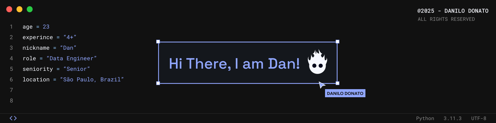

</img>

# 👾 Data Engineer & Developer

Hey whats up? My name is Danilo, but you can call me Dan.
 
I work with Data Engineering +3 years. I have a great zeal for delivering the best data engineering solutions and anything else the team needs. It doesn't matter if it's Front-end, Data Analysis, DevOps, as I'm pretty self-taught, I deliver what is needed.

Here in this repository you will find insane and surprising codes, not only from Data Engineering, but other areas as well!

🎓 Formation: Graduated in Systems Analysis and Development 
🎯 Skills: Python, SQL, Databricks Spark, AWS, Azure, Pentaho, Airflow 
⚛️ Learning: Snowflake
